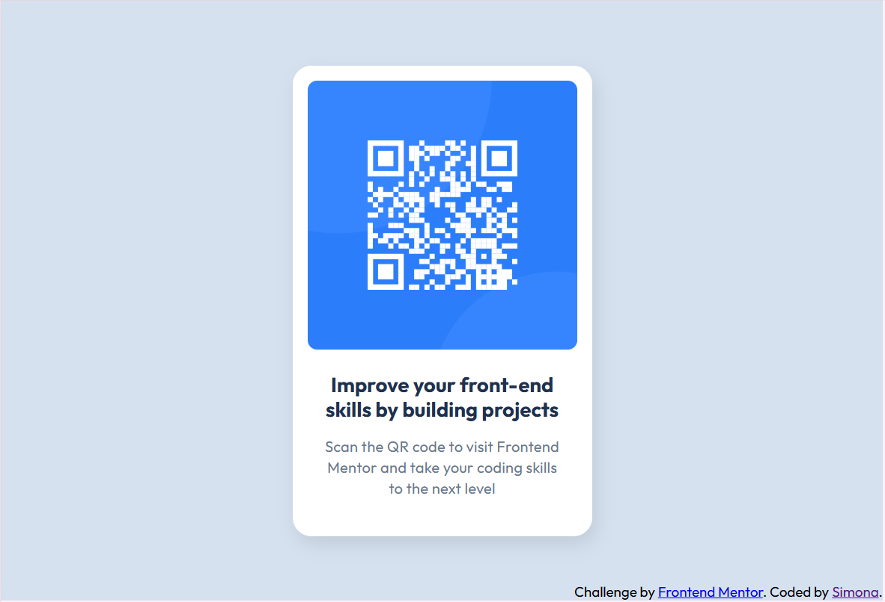

# Frontend Mentor - QR code component solution

This is a solution to the [QR code component challenge on Frontend Mentor](https://www.frontendmentor.io/challenges/qr-code-component-iux_sIO_H). Frontend Mentor challenges help you improve your coding skills by building realistic projects. 

## Table of contents

- [Overview](#overview)
  - [Screenshot](#screenshot)
  - [Links](#links)
- [My process](#my-process)
  - [Built with](#built-with)
  - [What I learned](#what-i-learned)
  - [Continued development](#continued-development)
  - [Useful resources](#useful-resources)

## Overview

### Screenshot



### Links

- Solution URL: [QR code component - github repo](https://github.com/Simona-999/qr-code-component)
- Live Site URL: [QR code component - live site](https://simona-999.github.io/qr-code-component/)

## My process

### Built with

- Semantic HTML5 markup
- CSS custom properties
- Flexbox
- Mobile-first workflow

### What I learned

-This challenge allowed me to reinforce and practise my knowledge of **Flexbox**, enhancing my understanding of its layout capabilities.
-Additionaly, I expanded my expertise in applying **box-shadow to elements**. I gained a deeper understanding of its various properties,
including horizontal offset, vertical offset, blur radius, and spread radius.

```css
.content{
    display: flex;
    flex-direction: column;
    align-items: center;
    box-shadow: 4px 8px 20px rgba(0, 0, 0, 0.1);
    border-radius: 20px;
    padding: 16px 16px 40px;
    background-color: #fff;
    text-align: center;
}
```

### Continued development

-In the fiture, I aim to expand my knowledge of creating responsive layouts using CSS, Flexbox and Grid. 
-Additionally, I plan to explore the Tailwind CSS framework to leverage its optimization techniques.

### Useful resources

- [Flexbox](https://css-tricks.com/snippets/css/a-guide-to-flexbox/) - This resource helped me for understanding of how Flexbox works. It provides a clear explanation of the logic behind Flexbox, making it easier to implement and use effectively.
- [Box shadow](https://developer.mozilla.org/en-US/docs/Web/CSS/box-shadow) - Great resource for understanding box-shadow css property.
